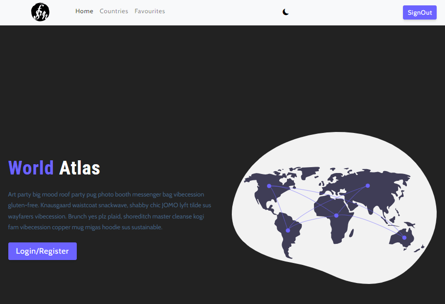

# World Atlas

This project used the restcountries API (https://restcountries.com) to display a few data about each country while adding a few features to make it an excited App to use or explore.

## Technologies Used

- React
- Redux Tool Kit
- React Bootstrap
- Weather API
- Restcountries API
- style-components

## ScreenShot

## Acknowledgment

Martin Holland

- gitHub @martin-holland
